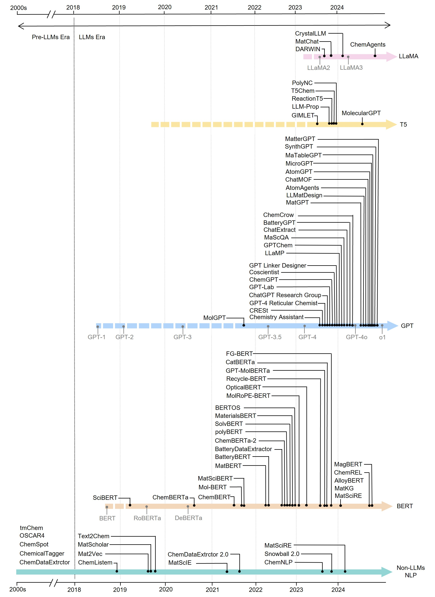

# Awesome - Materials-Aware Large Language Models [](https://github.com/sindresorhus/awesome)


**Materials-Aware Large Language Models** (LLMs) are transforming the field of materials science by automating complex tasks traditionally reliant on human expertise. Leveraging advancements in AI, these models facilitate everything from data extraction and property prediction to inverse design, synthesis planning and self-driven labs.

>  _Here, we provide a curated, non-exhaustive list of research papers that showcase the applications of LLMs in advancing materials science._


## 🌟 Introduction

  <div align=center></div>
  A non-exhaustive progression of LLMs tailored for materials science, highlighting key milestones within each general model family.


## 🔍 Applications Overview 
_sort by date_

> ### 📑 Data Extraction
> LLMs for data extraction can process text, images, tables, and graphs from scientific literature, converting unstructured information into structured data, which is essential for building comprehensive materials databases.

| **Name & Link**                          | **Models**                | **Material Types**                         | **Release Date** | **Journal** |
|------------------------------------------|---------------------------|--------------------------------------------|------------------|-------------|
| [MagBERT (Kumar et al.)](https://www.sciencedirect.com/science/article/pii/S2213956724002858) | BERT                      | Magnesium                                  | 2024.08          | *Materials Today Communications* |
| [MagBERT (Zhumabayeva et al.)](https://pubs.acs.org/doi/10.1021/acs.jpcc.4c01974) | BERT                      | Magnetic                                   | 2024.07          | *The Journal of Physical Chemistry C* |
| [ChemREL](https://pubs.acs.org/doi/10.1021/acs.jcim.4c00816) | RoBERTa                   | Chemicals                                  | 2024.07          | *Journal of Chemical Information and Modeling* |
| [LLaMat](https://openreview.net/forum?id=ZUkmRy6SqS) | LLaMA-2-7B                | Crystal                                    | 2024.07          | *OpenReview* |
| [MaTableGPT](https://arxiv.org/abs/2406.05431) | GPT-4                     | Electrocatalysts                           | 2024.06          | *arXiv* |
| [MatGPT](https://www.sciencedirect.com/science/article/pii/S2666389924000540) | GPT-3, LLaMA-7B           | Solar cell                                 | 2024.05          | *Cell Reports Physical Science* |
| [LLaMP](https://arxiv.org/abs/2401.17244) | GPT-3.5, GPT-4            | General materials                          | 2024.01          | *arXiv* |
| [MatSci-LumEn](https://github.com/lfoppiano/MatSci-LumEn) | GPT-3.5, GPT-4            | General materials                          | 2024.01          | *GitHub* |
| [MatSciRE](https://arxiv.org/abs/2401.09839) | BERT, RoBERTa             | General materials                          | 2024.01          | *arXiv* |
| [ACE](https://www.nature.com/articles/s41467-023-43836-5) | Transformer               | Single-atom heterogeneous catalysts        | 2023.12          | *Nature Communications* |
| [MechGPT](https://arxiv.org/abs/2310.10445) | OpenOrca-Platypus2-13B    | Materials failure                          | 2023.10          | *arXiv* |
| [DARWIN](https://arxiv.org/abs/2308.13565) | LLaMA-7B                  | Solar cell                                 | 2023.08          | *arXiv* |
| [GPT Chemistry Assistant](https://pubs.acs.org/doi/10.1021/jacs.3c05819) | GPT-3.5, GPT-4            | MOF                                        | 2023.06          | *Journal of the American Chemical Society* |
| [Recycle-BERT](https://pubs.acs.org/doi/10.1021/acssuschemeng.3c03162) | BERT                      | Recycling plastic                          | 2023.08          | *ACS Sustainable Chemistry & Engineering* |
| [GPT-MLP](https://www.nature.com/articles/s43246-024-00449-9) | GPT-3, GPT-3.5, GPT-4     | Solid-state, doped semiconductors, gold nanoparticle | 2023.08          | *Communications Materials* |
| [MatSci-NLP](https://arxiv.org/abs/2305.08264) | BERT                      | General materials                          | 2023.05          | *arXiv* |
| [ChatExtract](https://www.nature.com/articles/s41467-024-45914-8) | GPT-3.5, GPT-4            | High entropy alloys                        | 2023.03          | *Nature Communications* |
| [OpticalBERT](https://pubs.acs.org/doi/10.1021/acs.jcim.2c01259) | BERT                      | Optical                                    | 2023.03          | *Journal of Chemical Information and Modeling* |
| [BatteryDataExtractor](https://pubs.rsc.org/en/content/articlelanding/2022/sc/d2sc04322j) | BERT                      | Battery                                    | 2022.09          | *Chemical Science* |
| [MaterialsBERT](https://www.nature.com/articles/s41524-023-01003-w) | BERT                      | Polymer                                    | 2022.09          | *npj Computational Materials* |
| [BatteryBERT](https://pubs.acs.org/doi/10.1021/acs.jcim.2c00035) | BERT                      | Battery                                    | 2022.05          | *Journal of Chemical Information and Modeling* |
| [MatBERT](https://www.sciencedirect.com/science/article/pii/S2666389922000733) | BERT                      | Solid-state, doped semiconductors, gold nanoparticle | 2022.04          | *Patterns* |
| [MatSciBERT](https://www.nature.com/articles/s41524-022-00784-w) | BERT                      | Solid oxide fuel cells                     | 2021.09          | *npj Computational Materials* |
| [ChemRxnExtractor](https://pubs.acs.org/doi/10.1021/acs.jcim.1c00284) | BERT                      | Chemical Reaction                          | 2021.06          | *Journal of Chemical Information and Modeling* |
| [ChemBERT](https://pubs.acs.org/doi/10.1021/acs.jcim.1c00284) | BERT                      | Chemical Reaction                          | 2021.06          | *Journal of Chemical Information and Modeling* |
| [RXNMapper](https://www.science.org/doi/10.1126/sciadv.abe4166) | Transformer               | Chemical reactions                         | 2021.04          | *Science Advances* |
| [RXN4Chemistry](https://github.com/rxn4chemistry/rxn4chemistry) | Transformer               | Chemical reactions                         | 2019.12          | *GitHub* |
| [SciBERT](https://arxiv.org/abs/1903.10676)                           | BERT                      | General scientific text                    | 2019.03         | *arXiv* |

---

> ### 📊 Data Mining
> LLMs for data mining support advanced querying, knowledge graph construction, and answering complex questions within materials science.

| **Name**                          | **Models**                | **Material Types**                         | **Release Date** | **Journal** |
|-----------------------------------|---------------------------|--------------------------------------------|------------------|-------------|
| [SciQAG](https://arxiv.org/abs/2405.09939)                            | vicuna-7b-v1.5-16k        | Question-answering                         | 2024.05         | *arXiv* |
| [BatteryGPT](https://www.sciencedirect.com/science/article/pii/S2666386424000699?dgcid=rss_sd_all)  | ChatGPT                   | Question-answering                         | 2024.03         | *Cell Reports Physical Science* |
| [MatKG](https://www.nature.com/articles/s41597-024-03039-z)           | BERT                      | Knowledge graph                            | 2024.01         | *Scientific Data* |
| [LitLLM](https://arxiv.org/abs/2402.01788)                            | GPT-3.5, GPT-4            | Literature Review                          | 2023.12         | *arXiv* |
| [PaperQA](https://arxiv.org/abs/2312.07559)                           | GPT-3.5, GPT-4            | Question-answering                         | 2023.12         | *arXiv* |
| [LitQA](https://arxiv.org/abs/2312.07559)                             | GPT-3.5, GPT-4            | Question-answering                         | 2023.10         | *arXiv* |

---

> ### 🧬 Property Prediction
> LLMs assist in predicting various properties of materials, helping researchers design new materials with targeted characteristics.

| **Name**                          | **Models**                | **Material Types**                         | **Release Date** | **Journal** |
|-----------------------------------|---------------------------|--------------------------------------------|------------------|-------------|
| [MolecularGPT](https://arxiv.org/abs/2406.12950)                      | T5                        | Organic molecule                           | 2024.06         | *arXiv* |
| [ChatMOF](https://www.nature.com/articles/s41467-024-48998-4)         | GPT-4, GPT-3.5            | MOF                                        | 2024.06         | *Nature Communications* |
| [ChemLLM](https://arxiv.org/abs/2402.06852)                           | InternLM2-Base-7B         | Organic molecule                           | 2024.04         | *arXiv* |
| [AlloyBERT](https://arxiv.org/abs/2403.19783)                         | RoBERTa                   | Alloy                                      | 2024.03         | *arXiv* |
| [CrystalLLM (Gruver et al.)](https://arxiv.org/abs/2402.04379)        | LLaMA-2 70B               | Inorganic                                  | 2024.02         | *arXiv* |
| [GPTChem](https://www.nature.com/articles/s42256-023-00788-1)         | GPT-3                     | Organic molecule                           | 2024.02         | *Nature Machine Intelligence* |
| [LLaMP](https://arxiv.org/abs/2401.17244)                             | GPT-3.5, GPT-4            | Crystal                                    | 2024.01         | *arXiv* |
| [PolyNC](https://pubs.rsc.org/en/content/articlelanding/2024/sc/d3sc05079c)  | T5                        | Polymer                                    | 2023.12         | *Chemical Science* |
| [FG-BERT](https://academic.oup.com/bib/article/24/6/bbad398/7337693)  | BERT                      | Organic molecule                           | 2023.11         | *Briefings in Bioinformatics* |
| [LLM-Prop](https://arxiv.org/abs/2310.14029)                          | T5                        | Crystalline Solids                         | 2023.10         | *arXiv* |
| [GPT-MolBERTa](https://arxiv.org/abs/2310.03030)                      | BERT, RoBERTa             | Organic molecule                           | 2023.09         | *arXiv* |
| [CatBERTa](https://pubs.acs.org/doi/10.1021/acscatal.3c04956)         | RoBERTa                   | Catalyst                                   | 2023.09         | *ACS Catalysis* |
| [DARWIN](https://arxiv.org/abs/2308.13565)                            | LLaMA-7B                  | Thermoelectric                             | 2023.08         | *arXiv* |
| [GIMLET](https://arxiv.org/abs/2306.13089)                            | T5                        | Thermoelectric                             | 2023.08         | *arXiv* |
| [MolRoPE-BERT](https://www.sciencedirect.com/science/article/pii/S1093326322002236) | T5                        | Organic molecule                           | 2023.07         | *Journal of Molecular Graphics and Modelling* |
| [BERTOS](https://onlinelibrary.wiley.com/doi/full/10.1002/advs.202301011)  | BERT                      | Inorganic                                  | 2022.11         | *Advanced Science* |
| [SolvBERT](https://pubs.rsc.org/en/content/articlelanding/2023/dd/d2dd00107a) | BERT                      | Solvent                                    | 2022.10         | *Digital Discovery* |
| [PolyBERT](https://www.nature.com/articles/s41467-023-39868-6)        | DeBERTa                   | Polymer                                    | 2022.09         | *Nature Communications* |
| [ChemBERTa](https://arxiv.org/abs/2010.09885)                         | RoBERTa                   | Organic molecule                           | 2022.08         | *arXiv* |
| [ChemGPT](https://www.nature.com/articles/s42256-023-00740-3)         | GPT-Neo                   | Organic molecule                           | 2022.05         | *Nature Machine Intelligence* |
| [Mol-BERT](https://onlinelibrary.wiley.com/doi/10.1155/2021/7181815)  | BERT                      | Organic molecule                           | 2022.05         | *Journal of Chemistry* |
| [ChemBERTa](https://arxiv.org/abs/2010.09885)                         | RoBERTa                   | Organic molecule                           | 2022.03         | *arXiv* |
| [SMILES-BERT](https://github.com/uta-smile/SMILES-BERT)               | BERT                      | RT                                         | 2019.09         | *Proceedings of the 10th ACM international conference on bioinformatics, computational biology and health informatics* |

---

> ### ⚛️ Structure Generation
> LLMs contribute to generating new material structures, especially for complex materials, enabling accelerated discovery of novel materials.

| **Name**                          | **Models**                | **Material Types**                         | **Release Date** | **Journal** |
|-----------------------------------|---------------------------|--------------------------------------------|------------------|-------------|
| [ChatMol](https://academic.oup.com/bioinformatics/article/40/9/btae534/7747661) | T5                        | MOF                                        | 2024.09         | *Bioinformatics* |
| [MatterGPT](https://arxiv.org/abs/2408.07608)                         | Customized GPT            | Crystalline Solids                         | 2024.08         | *arXiv* | 
| [MOLLEO](https://arxiv.org/abs/2406.16976)                            | GPT-4, T5                 | Organic molecule                           | 2024.07         | *arXiv* |
| [AtomGPT](https://pubs.acs.org/doi/10.1021/acs.jpclett.4c01126)       | GPT-2                     | Crystalline Solids                         | 2024.06         | *The Journal of Physical Chemistry Letters* |
| [ChatMOF](https://www.nature.com/articles/s41467-024-48998-4)         | GPT-4, GPT-3.5            | MOF                                        | 2024.06         | *Nature Communications*
| [CrystalLLM (Antunes et al.)](https://arxiv.org/abs/2307.04340)       | Transformer-based         | Rutiles, spinels, pyrochlores              | 2024.02         | *arXiv* |
| [GPTChem](https://www.nature.com/articles/s42256-023-00788-1)         | GPT-3                     | Organic molecule                           | 2024.02         | *Nature Machine Intelligence* |
| [GPT Linker Designer](https://pubs.acs.org/doi/10.1021/jacs.3c12086)  | GPT-3.5                   | MOF Linker                                 | 2023.12         | *Journal of the American Chemical Society* |
| [DARWIN](https://arxiv.org/abs/2308.13565)                            | LLaMA-7B                  | MOF                                        | 2023.08         | *arXiv* |
| [Text+Chem T5](https://arxiv.org/abs/2301.12586)                      | T5                        | Inorganic                                  | 2023.02         | *arXiv* |
| [MolT5](https://arxiv.org/abs/2204.11817)                             | T5                        | Inorganic                                  | 2022.11         | *arXiv* |
| [MT-GPT](https://arxiv.org/abs/2206.13578)                            | GPT                       | Inorganic                                  | 2022.10         | *arXiv* |
| [MT-GPT2](https://arxiv.org/abs/2206.13578)                           | GPT-2                     | Inorganic                                  | 2022.10         | *arXiv* |
| [MT-GPTNeo](https://arxiv.org/abs/2206.13578)                         | GPT-Neo                   | Inorganic                                  | 2022.10         | *arXiv* |
| [MT-GPTJ](https://arxiv.org/abs/2206.13578)                           | GPT-J                     | Inorganic                                  | 2022.10         | *arXiv* |
| [MT-BART](https://arxiv.org/abs/2206.13578)                           | BART                      | Inorganic                                  | 2022.10         | *arXiv* |
| [MT-RoBERTa](https://arxiv.org/abs/2206.13578)                        | RoBERTa                   | Inorganic                                  | 2022.10         | *arXiv* |
| [MolGPT](https://pubs.acs.org/doi/10.1021/acs.jcim.1c00600)           | Customized GPT            | Organic molecule                           | 2021.10         | *Journal of Chemical Information and Modeling* |

---

> ### 🧪 Synthesis Planning
> LLMs are employed to predict synthesis routes, aiding researchers in planning experiments and identifying potential synthesis challenges.

| **Name**                          | **Models**                | **Material Types**                         | **Release Date** | **Journal** |
|-----------------------------------|---------------------------|--------------------------------------------|------------------|-------------|
| [CSLLM](https://arxiv.org/abs/2407.07016)                             | LLaMA-7B                  | Crystal                                    | 2024.07         | *arXiv* |
| [SynthGPT](https://pubs.acs.org/doi/10.1021/jacs.4c05840)             | GPT-3.5, GPT-4            | Inorganic                                  | 2024.04         | *Journal of the American Chemical Society* |
| [ReactionT5](https://arxiv.org/abs/2311.06708)                        | T5                        | Organic                                    | 2023.03         | *arXiv* |
| [MatChat](https://arxiv.org/abs/2310.07197)                           | LLaMA2                    | Inorganic                                  | 2023.10         | *arXiv* |
| [GPT Chemistry Assistant](https://pubs.acs.org/doi/10.1021/jacs.3c05819) | GPT-3.5, GPT-4            | MOF                                        | 2023.08         | *Journal of the American Chemical Society* |
| [T5Chem](https://pubs.acs.org/doi/10.1021/acs.jcim.1c01467)           | T5                        | Organic                                    | 2022.03         | *Journal of the American Chemical Society* |
| [ChemFormer](https://iopscience.iop.org/article/10.1088/2632-2153/ac3ffb) | BART                      | Organic                                    | 2022.01         | *Machine Learning: Science and Technology* |

---

> ### 🤖 Agent-Driven Laboratory
> LLM-based agent systems facilitate laboratory automation by controlling instruments, analyzing real-time data, and autonomously adjusting experiments.

| **Name**                          | **Models**                | **Material Types**                         | **Release Date** | **Journal** |
|-----------------------------------|---------------------------|--------------------------------------------|------------------|-------------|
| [ChemAgents](https://chemrxiv.org/engage/chemrxiv/article-details/66a8c11bc9c6a5c07a7a59c0)                        | Llama-3-70B               | Literature reader, experiments designer, robot operator, computation performer | 2024.07         | *ChemRxiv* |
| [LLMatDesign](https://arxiv.org/abs/2406.13163)                       | GPT-4o                    | Data acquisition and filtering, integrated simulations, data analysis and visualization | 2024.06         | *arXiv* |
| [MicroGPT](https://pubs.rsc.org/en/content/articlelanding/2024/dd/d4dd00074a)  | GPT-4                     | -                                          | 2024.05         | *Digital Discovery* |
| [ChatGPT Research Group](https://pubs.acs.org/doi/10.1021/acscentsci.3c01087) | GPT-4                     | Synthesis conditions extraction, code generation, research planning, and procedural guidance | 2023.11         | *ACS Central Science* |
| [GPT-Lab](https://arxiv.org/abs/2309.16721)                           | GPT-4                     | Requirements analysis, literature retrieval, text mining, human researcher feedback, experiment execution | 2023.09         | *arXiv* |
| [AtomAgents](https://arxiv.org/html/2407.10022v1)                     | GPT-4                     | Automatic robotic experiments              | 2023.07         | *arXiv* |
| [CREST](https://chemrxiv.org/engage/chemrxiv/article-details/64a81dcd6e1c4c986bf83225)  | GPT-3.5                   | -                                          | 2023.07         | *ChemRxiv* |
| [GPT-4 Reticular Chemist](https://onlinelibrary.wiley.com/doi/10.1002/anie.202311983)  | GPT-4                     | Project overview, progress summary, propose task choices, evaluation | 2023.06         | *Angewandte Chemie International Edition* |
| [ChemCrow](https://www.nature.com/articles/s42256-024-00832-8)        | GPT-4                     | Synthesis execution                        | 2023.04         | *Nature Machine Intelligence* |
| [Coscientist](https://www.nature.com/articles/s41586-023-06792-0)     | GPT-4                     | Web and documentation search, code execution | 2023.03         | *Nature* |


## Citation

If you find our work and this repository useful, please consider giving a star :star: and citation :beer::

```
@misc{yuan2024materials,
      title={Materials-Aware Large Language Models as Enablers of Scaling Metadata Ontology and Autonomous Discovery}, 
      author={Wenhao Yuan, Guangyao Chen, Zhilong Wang and Fengqi You},
      year={2024},
      note={Unpublished manuscript},
      institution={Cornell University},
      url={https://github.com/PEESEgroup/Awesome-Materials-Aware-Large-Language-Models}
}
```


### How to Contribute

Contributions are welcome! Please submit a pull request to add new resources, models, or papers to the repository.

